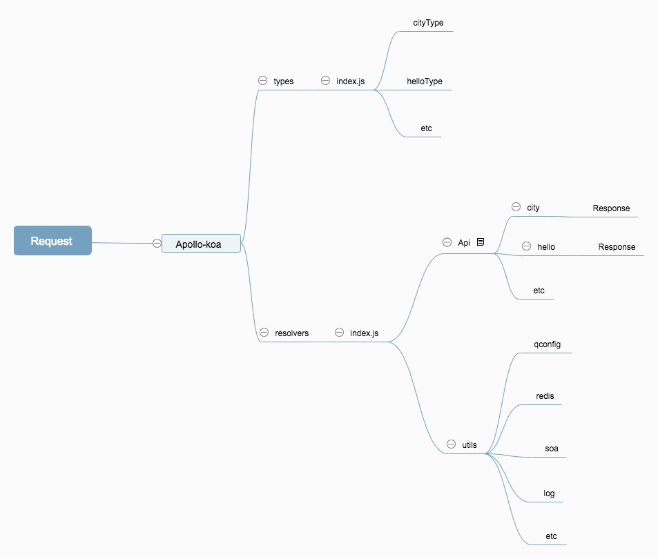

oneQL
--------
Use koa + apollo-server-koa

快速开始
---------
- clone模板仓库 (后续考虑cli创建)
- npm install
- npm run dev

- 访问：(http://localhost:3600/graphql)

```js
query db($key: String, $ext: [ExtensionType]){
  hello
  city(request: {key: $key,  ext: $ext } ) {
    datainfo{
      CountryId
      country
      type
    }
  }
}
```

##### QUERY VARIABLES
```js
{"key":"D", "ext": [{ "key":"2", "value":"1"}] }
```


```js
query simple{
  seatSimple {
    resultList{
      fInfo{
        fNo
      }
    }
  }
}
```

开发建议
----------
- 一个请求可以带多个schema，对应请求逻辑是resolvers文件夹下index.js, connect所有resolvers
- 每一个最外层schema分一个对应的types文件和一个resolvers文件
- types文件夹下index.js , connect所有types
- 每一个schema具体数据实现，如果涉及请求，建议api文件夹里建一个文件处理逻辑


Util 功能
------------
+ util提供了soa请求封装，如自动处理埋点信息；
+ 提供xconfig集成；
+ 提供redis方法集成
+ 提供log方法集成

生产模式
-------
- 需要关闭graphlQL 调试工具
- 根据package.json , env变量 判断prod 或者只dev和fat环境开启

```js
const server = new ApolloServer({
  typeDefs,
  // mocks
  resolvers
  // playground: false  // false为关闭
})
```

思维图
--------
