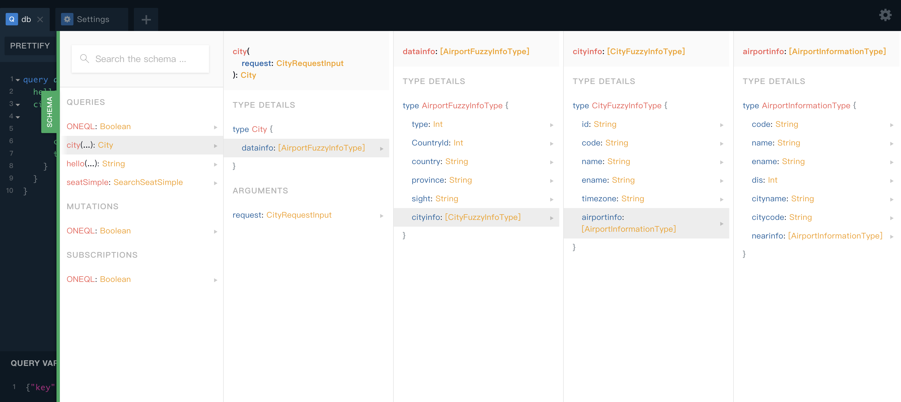

快速开始
------

```sh
# step 1
npm install oneql-init -g

# step 2
oneql-init project

#step 3
cd project && npm install && npm run dev
```

#### 初始化oneQL (模板已自动生成)

```sh
// src/index.ts
import oneql from 'oneql'

import typeDefs from './types'
import resolvers from './resolvers'

new oneql({
    schema: {
        typeDefs,
        resolvers
    },
    context: async ({ ctx }) => {
        return {
            ctx
        }
    }
})
```

#### 事例查看:
<p>访问：http://localhost:3600/graphql</p>

<p>输入请求schema 和 查询变量, 点击运行</p>

```js
query db($key: String, $ext: [ExtensionType]){
  hello
  city(request: {key: $key,  ext: $ext } ) {
    datainfo{
      CountryId
      country
      type
    }
  }
}
```

##### QUERY VARIABLES
```js
{"key":"D", "ext": [{ "key":"2", "value":"1"}] }
```


#### 查看Schema详情

最右边绿色的SCHEMA 按钮


