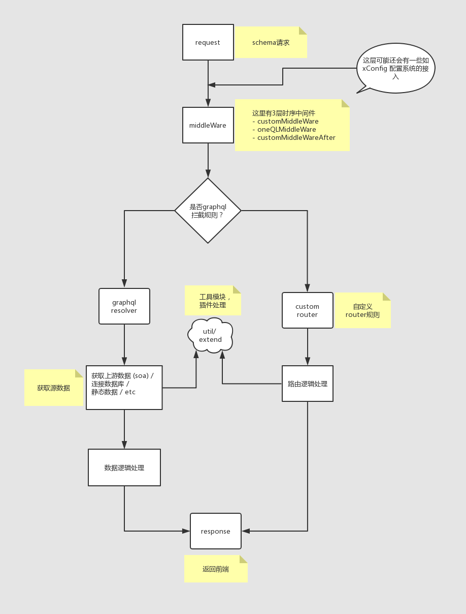

推荐实践
---------

来到这里，假定你对nodejs 和 graphql有一定的了解。 
之所以推荐graphql，因为graphql能不多也不少 正好满足你需求；面对日益增多的界面、交互变化，graphql如鱼得水。 
oneQL推荐项目都用typescript书写代码，因为typescript能理清楚每个函数，模块的入参与入参类型，让你的项目更加安全、稳定。 

数据处理流程
------

oneQL定位很清晰、简单，就是前端API获取的一层轻量的数据聚合，处理层。

oneQL把中间件分了3个时序， oneQL默认有一部分中间件处理，然后用户可以自定义在默认时序前 或 后执行一系列中间件

